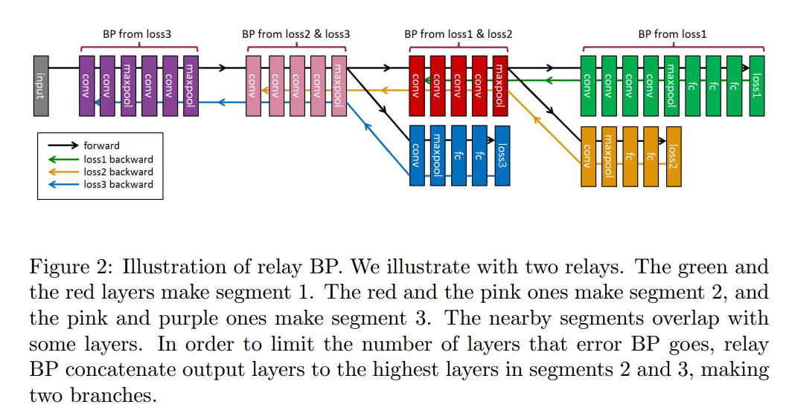

---

title: Learning Deep Convolutional Neural Networks for Places2 Scene Recognition
layout: default
categories: [Paper Reading]
tags: [Deep Learning, CNN, Places2, Scene Recognition]

---

### Introduction

论文描述了作者在ILSVRC 2015场景分类竞赛中夺冠所采用的模型结构和优化思想，主要包括以下几点：

1. Relay BP；
2. VGG+Inception+SPP；
3. Class-aware Sampling。

### Relay BP
CNN训练中经常遇到的梯度消失或者爆炸问题，已经可以通过Batch Normalization（BN）或者Auxiliary Loss（AL，见DSN论文）来解决。

尽管更深的网络具有更好的表达能力，但随着网络层数的增多，网络的性能未必会却随之提升，甚至会有所损害。如下表，作者在Places2数据集上训练VGG结构的模型，随着深度从19增加到25，Top5的错误率是慢慢上升的。

|Depth | 19 | 22 | 25 |
|--|--|--|--|
|Top5 Err. | 18.93% | 19.00% | 19.21% |

这个问题既然不是由于梯度的原因导致的，而作者在实验中也未曾发现过拟合的现象，那怎么来解释呢？作者从数据处理的角度来考虑这个问题，认为是BP的过程中，反向传播的层数太多，导致了信息的损失。于是，提出了Relay BP，限制BP中的Error只反向传播一定数量的层数。

Relay BP的操作有点类似DSN，通过引入额外的AL来进行BP，不同的地方在于，DSN每个AC的Loss都会一层层反向传播到最底层，而Relay BP的每个AC只负责反向传播到一定层数（<=N层）就停止，然后由另外一个AC接力，向底层反向传播误差，依此继续下去。两个相邻AC之间有重叠（比如重叠n层）。这里的N和n都是需要靠经验调整的。

有重叠的层，就采用加权平均的方式计算梯度，没有重叠的层，就直接采用BP计算得到的梯度。这样，通过SGD就可以对整个网络进行求解。

### 网络结构
作者采用了A和B两种网络结构模型。

A模型是VGG19的加深版，即conv3，conv4和conv5后都多加了一个conv层，得到一个VGG22模型。

B模型采用Inception结构，第一层采用7x7:2和2x2:2的conv+pool，随后接了三组Inception，每组Inception包括4个Inception模块，每组Inception后接2x2:2的pool。

两个模型相同点在于最后一个pool均采用[7,3,2,1]的SPP，然后接了2个4096的FC层和1个401类的Softmax。此外，在28x28分辨率（A模型的conv4，B模型的第二组Inception）上的conv+pool之后采用一个额外的Loss（在lr降到0.001的时候才引入），进行BP。

### Class-aware Sampling

Places2数据集有401类809万训练样本，每类包括4000-30000样本不等。

这种大规模的数据集以及类别的不均衡，会给建模带来挑战，于是作者采用了一种基于类别的均匀采样方式，采用两种list（class list + image list），分两步走：首先是从class list中随机选择一个类别，然后在该类别的image list中随机选择图像。当一个image list都被选择过一遍之后，对这个list进行shuffle。在calss list都被过一遍之后，也进行shuffle。

这种基于类别的均匀采样，可以在验证集上提升0.6%左右的性能。

### 结果
* 额外增加一个loss，对top5性能有微小的提升（0.00%-0.18%）
* Relay BP相对BP，对top5性能有较大幅度的提升（0.53%-1.17%）
* single model相对center crop的top5性能提升，并不像在ImageNet上那么明显（仅1.5%-1.8%左右）
* A/B两个模型Ensemble，性能提升也不明显，约为0.4%

|method | testing | A top1 | A top5 | B top1 | B top5|
|--|--|--|--|--|--|
|loss1+BP| center|50.91|19.00|50.62|18.69
|loss1&2+BP|center|50.72|18.84|50.59|18.68
|loss1&2+Relay BP|center|49.75|17.83|49.77|17.86
|loss1+BP| single|48.67|17.19|48.29|16.89
|loss1&2+BP|single|48.55|17.05|48.27|16.89
|loss1&2+Relay BP|single|47.86|16.35|47.72|16.36